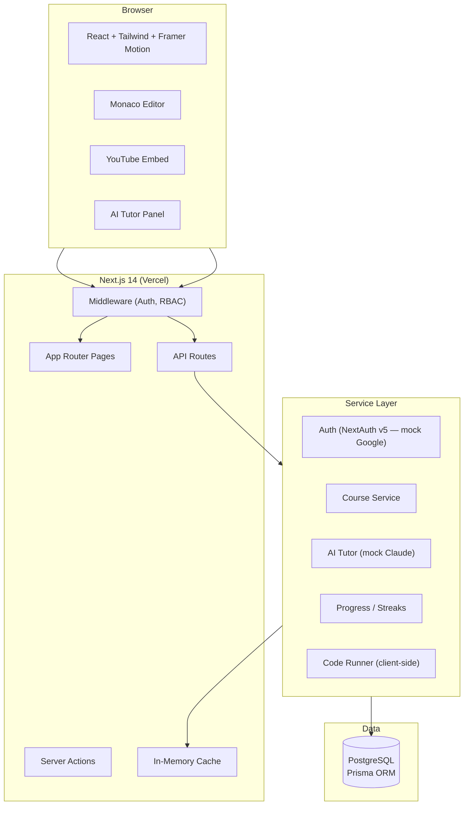

# Trilingua AI — Final Implementation Plan

> **Status:** FINAL — Awaiting approval to begin coding
> **Last updated:** 2026-04-15

---

## Decisions Locked

| Question | Decision |
|----------|----------|
| Product name | **Trilingua AI** |
| Database | PostgreSQL (Prisma ORM) — direct connection |
| Caching | In-memory only (no Redis). Use `node-cache` or Next.js built-in caching where necessary |
| API keys | All mocked. Integration points wired but using mock data/responses |
| Code execution | Client-side: Pyodide (Python) + sandboxed iframe (JS) |
| Deployment | Vercel |
| Scope | **Phases 1–6 fully built**, Phases 7–9 stubbed with explicit TODOs |
| Tailwind | v3 (stable) |
| Future | Website first → mobile app conversion later |

---

## System Architecture (Simplified for Demo)



> [!NOTE]
> **All external integrations are mocked for the demo:**
> - Google OAuth → NextAuth credentials provider with test accounts
> - Claude AI → Mock responses with realistic delay + canned multilingual replies
> - Razorpay → Stubbed payment flow (Phase 7 TODO)
> - YouTube Data API → Seed data hardcoded from the playlist file

---

## Complete Folder Structure

```
trilingua-ai/
├── prisma/
│   ├── schema.prisma
│   ├── seed.ts                    # Seed courses from playlist file
│   └── migrations/
│
├── public/
│   ├── logo.svg
│   ├── images/
│   │   ├── domains/               # Domain icons/thumbnails
│   │   └── onboarding/            # Onboarding illustrations
│   └── fonts/
│
├── src/
│   ├── app/
│   │   ├── layout.tsx             # Root layout (Inter font, theme provider)
│   │   ├── page.tsx               # Landing → redirect to /dashboard or /login
│   │   ├── globals.css            # Tailwind base + custom tokens
│   │   │
│   │   ├── (auth)/
│   │   │   ├── login/
│   │   │   │   └── page.tsx       # Login page with mock Google sign-in
│   │   │   └── layout.tsx         # Auth layout (centered, no sidebar)
│   │   │
│   │   ├── (app)/
│   │   │   ├── layout.tsx         # App shell (sidebar + header)
│   │   │   ├── dashboard/
│   │   │   │   └── page.tsx       # Main dashboard
│   │   │   ├── onboarding/
│   │   │   │   └── page.tsx       # AI onboarding interview
│   │   │   ├── courses/
│   │   │   │   ├── page.tsx       # Course catalog
│   │   │   │   └── [slug]/
│   │   │   │       ├── page.tsx   # Course detail
│   │   │   │       └── learn/
│   │   │   │           └── [lessonId]/
│   │   │   │               └── page.tsx  # Lesson player (split-screen)
│   │   │   ├── practice/
│   │   │   │   └── [exerciseId]/
│   │   │   │       └── page.tsx   # Code sandbox
│   │   │   ├── my-learning/
│   │   │   │   └── page.tsx       # Enrolled courses + progress
│   │   │   ├── analytics/
│   │   │   │   └── page.tsx       # Learning analytics
│   │   │   ├── tutor/
│   │   │   │   └── page.tsx       # Full-screen AI tutor chat
│   │   │   ├── subscription/
│   │   │   │   └── page.tsx       # Pricing page (TODO: payment flow)
│   │   │   └── profile/
│   │   │       └── page.tsx       # User profile & settings
│   │   │
│   │   ├── admin/                 # TODO: Phase 8 (stubbed)
│   │   │   ├── layout.tsx
│   │   │   └── page.tsx           # Stub dashboard
│   │   │
│   │   └── api/
│   │       ├── auth/
│   │       │   └── [...nextauth]/
│   │       │       └── route.ts
│   │       ├── user/
│   │       │   ├── me/route.ts
│   │       │   ├── profile/route.ts
│   │       │   └── onboarding/route.ts
│   │       ├── courses/
│   │       │   ├── route.ts
│   │       │   ├── recommended/route.ts
│   │       │   └── [slug]/
│   │       │       ├── route.ts
│   │       │       ├── lessons/route.ts
│   │       │       └── enroll/route.ts
│   │       ├── progress/
│   │       │   ├── update/route.ts
│   │       │   ├── overview/route.ts
│   │       │   └── course/[courseId]/route.ts
│   │       ├── streaks/
│   │       │   ├── route.ts
│   │       │   └── checkin/route.ts
│   │       ├── tutor/
│   │       │   ├── chat/route.ts
│   │       │   └── sessions/
│   │       │       ├── route.ts
│   │       │       └── [id]/route.ts
│   │       ├── practice/
│   │       │   ├── [exerciseId]/route.ts
│   │       │   └── submit/route.ts
│   │       ├── domains/route.ts
│   │       ├── subscription/       # TODO: Phase 7
│   │       │   └── route.ts
│   │       └── admin/              # TODO: Phase 8
│   │           └── route.ts
│   │
│   ├── components/
│   │   ├── ui/                    # Base design system
│   │   │   ├── Button.tsx
│   │   │   ├── Card.tsx
│   │   │   ├── Input.tsx
│   │   │   ├── Badge.tsx
│   │   │   ├── Modal.tsx
│   │   │   ├── Tabs.tsx
│   │   │   ├── Select.tsx
│   │   │   ├── Skeleton.tsx
│   │   │   ├── Toast.tsx
│   │   │   ├── DataTable.tsx
│   │   │   └── ThemeToggle.tsx
│   │   │
│   │   ├── layout/                # Shell components
│   │   │   ├── Sidebar.tsx
│   │   │   ├── Header.tsx
│   │   │   ├── MobileNav.tsx
│   │   │   └── AppShell.tsx
│   │   │
│   │   ├── course/                # Course-specific
│   │   │   ├── CourseCard.tsx
│   │   │   ├── CourseGrid.tsx
│   │   │   ├── CourseCurriculum.tsx
│   │   │   ├── LessonItem.tsx
│   │   │   ├── VideoPlayer.tsx
│   │   │   └── LangSwitch.tsx
│   │   │
│   │   ├── dashboard/             # Dashboard widgets
│   │   │   ├── StatCard.tsx
│   │   │   ├── ProgressRing.tsx
│   │   │   ├── StreakBadge.tsx
│   │   │   ├── ContinueLearning.tsx
│   │   │   ├── RecommendedCourses.tsx
│   │   │   └── RecentActivity.tsx
│   │   │
│   │   ├── tutor/                 # AI Tutor
│   │   │   ├── TutorChat.tsx
│   │   │   ├── ChatBubble.tsx
│   │   │   ├── ChatInput.tsx
│   │   │   └── SuggestedQuestions.tsx
│   │   │
│   │   ├── practice/              # Code sandbox
│   │   │   ├── CodeEditor.tsx
│   │   │   ├── OutputPanel.tsx
│   │   │   ├── TestCaseDisplay.tsx
│   │   │   └── ExerciseInstructions.tsx
│   │   │
│   │   ├── analytics/             # Charts & visualizations
│   │   │   ├── Heatmap.tsx
│   │   │   ├── WeeklyChart.tsx
│   │   │   └── DomainProgress.tsx
│   │   │
│   │   └── onboarding/            # Onboarding flow
│   │       ├── OnboardingChat.tsx
│   │       └── StepIndicator.tsx
│   │
│   ├── lib/
│   │   ├── db.ts                  # Prisma client singleton
│   │   ├── auth.ts                # NextAuth config
│   │   ├── env.ts                 # Env validation (Zod)
│   │   ├── logger.ts              # Console-based structured logging
│   │   ├── cache.ts               # In-memory cache wrapper
│   │   ├── validators.ts          # Zod schemas for API validation
│   │   │
│   │   ├── services/
│   │   │   ├── user.ts
│   │   │   ├── onboarding.ts
│   │   │   ├── course.ts
│   │   │   ├── lesson.ts
│   │   │   ├── progress.ts
│   │   │   ├── streak.ts
│   │   │   ├── analytics.ts
│   │   │   ├── tutor.ts           # AI tutor orchestration
│   │   │   ├── practice.ts
│   │   │   └── subscription.ts    # TODO: Phase 7
│   │   │
│   │   ├── mock/
│   │   │   ├── claude.ts          # Mock Claude API responses
│   │   │   ├── auth.ts            # Mock OAuth provider
│   │   │   └── courses.ts         # Seed course data
│   │   │
│   │   └── utils/
│   │       ├── cn.ts              # className merger (clsx + twMerge)
│   │       ├── format.ts          # Date, number formatters
│   │       └── constants.ts       # App-wide constants
│   │
│   ├── hooks/
│   │   ├── useAuth.ts
│   │   ├── useTheme.ts
│   │   ├── useProgress.ts
│   │   ├── useChat.ts
│   │   └── useLang.ts
│   │
│   ├── providers/
│   │   ├── ThemeProvider.tsx
│   │   ├── AuthProvider.tsx
│   │   └── ToastProvider.tsx
│   │
│   └── types/
│       ├── index.ts               # Shared TypeScript types
│       ├── api.ts                 # API request/response types
│       └── course.ts              # Course-related types
│
├── .env.example                   # All env vars documented
├── .env.local                     # Local dev values (gitignored)
├── .gitignore
├── next.config.js
├── tailwind.config.ts
├── tsconfig.json
├── postcss.config.js
├── package.json
└── README.md
```

**Total: ~85 files** across 6 phases.

---

## Data Model (Final — Prisma Schema)

### Tables Built (Phases 1–6): 22 tables

| Table | Phase | Purpose |
|-------|-------|---------|
| `User` | 1 | Core user identity |
| `Account` | 2 | OAuth accounts (NextAuth) |
| `Session` | 2 | Auth sessions (NextAuth) |
| `VerificationToken` | 2 | Email verification (NextAuth) |
| `LearnerProfile` | 2 | Learner preferences & level |
| `OnboardingAnswer` | 2 | Onboarding interview responses |
| `Domain` | 3 | Learning domains (AI, Cyber, etc.) |
| `Course` | 3 | Courses within domains |
| `LanguageVariant` | 3 | Course titles in EN/TA/HI |
| `Playlist` | 3 | YouTube playlist sources |
| `Lesson` | 3 | Individual lessons in a course |
| `VideoLink` | 3 | YouTube video per lesson per language |
| `PracticeExercise` | 5 | Code exercises |
| `CodeSubmission` | 5 | User code submissions |
| `Quiz` | 3 | Lesson quizzes |
| `QuizAttempt` | 6 | Quiz answer records |
| `Enrollment` | 3 | Course enrollments |
| `Progress` | 6 | Lesson-level progress |
| `Streak` | 6 | Daily activity streaks |
| `ChatSession` | 4 | AI tutor conversations |
| `ChatMessage` | 4 | Individual chat messages |
| `ProjectDemo` | 3 | Project demonstrations |

### Tables Stubbed (Phases 7–9): 7 tables

| Table | Phase | Status |
|-------|-------|--------|
| `Subscription` | 7 | TODO — schema defined, no logic |
| `FeatureAccess` | 7 | TODO |
| `Payment` | 7 | TODO |
| `ResearchDocument` | 7 | TODO |
| `AuditLog` | 9 | TODO |
| `FeatureFlag` | 8 | TODO |
| `SystemPrompt` | 8 | TODO |

---

## API Endpoints (Final)

### Fully Built (Phases 1–6)

#### Auth (Phase 2)
| Method | Route | Description |
|--------|-------|-------------|
| `*` | `/api/auth/[...nextauth]` | NextAuth handlers (mock Google) |

#### User (Phase 2)
| Method | Route | Description |
|--------|-------|-------------|
| `GET` | `/api/user/me` | Current user + profile |
| `PUT` | `/api/user/profile` | Update preferences |
| `POST` | `/api/user/onboarding` | Submit onboarding answers |

#### Courses (Phase 3)
| Method | Route | Description |
|--------|-------|-------------|
| `GET` | `/api/domains` | List domains |
| `GET` | `/api/courses` | List courses (filter, paginate) |
| `GET` | `/api/courses/recommended` | AI-recommended courses |
| `GET` | `/api/courses/[slug]` | Course detail |
| `GET` | `/api/courses/[slug]/lessons` | Lesson list |
| `POST` | `/api/courses/[slug]/enroll` | Enroll in course |

#### AI Tutor (Phase 4)
| Method | Route | Description |
|--------|-------|-------------|
| `POST` | `/api/tutor/chat` | Send message → mock AI response |
| `GET` | `/api/tutor/sessions` | List sessions |
| `POST` | `/api/tutor/sessions` | Create session |
| `GET` | `/api/tutor/sessions/[id]` | Get session messages |

#### Practice (Phase 5)
| Method | Route | Description |
|--------|-------|-------------|
| `GET` | `/api/practice/[exerciseId]` | Get exercise |
| `POST` | `/api/practice/submit` | Submit code |

#### Progress & Streaks (Phase 6)
| Method | Route | Description |
|--------|-------|-------------|
| `POST` | `/api/progress/update` | Update lesson progress |
| `GET` | `/api/progress/overview` | Dashboard stats |
| `GET` | `/api/progress/course/[courseId]` | Course progress |
| `GET` | `/api/streaks` | Streak data |
| `POST` | `/api/streaks/checkin` | Daily check-in |

### Stubbed (Phases 7–9)

| Route | Phase | Status |
|-------|-------|--------|
| `/api/subscription/*` | 7 | Returns mock data |
| `/api/webhooks/razorpay` | 7 | No-op endpoint |
| `/api/admin/*` | 8 | Returns mock data |

---

## Seed Content Map

The 18 YouTube links map to **7 domains** and produce **~18 courses** across **3 languages**:

### Domain: AI & Automation
| Course | Language | Source | Type |
|--------|----------|--------|------|
| Claude Cowork Masterclass | Tamil | `D61JR8jb3JE` | Single video |
| Generative AI Full Course | English | `mEsleV16qdo` | Single video |

### Domain: Deep Learning
| Course | Language | Source | Type |
|--------|----------|--------|------|
| Deep Learning (5MinEng) | English | Playlist `PLYwpaL_SFmcD-...` | Playlist |
| Deep Learning in Tamil | Tamil | Playlist `PLJtSFa-YIed...` | Playlist |
| Deep Learning Crash Course | English | `VyWAvY2CF9c` | Single video |

### Domain: Cybersecurity
| Course | Language | Source | Type |
|--------|----------|--------|------|
| Harvard CS50 Cybersecurity | English | `9HOpanT0GRs` | Single video |
| CyberSecurity & Ethical Hacking | Tamil | Playlist `PLfKsTB9vcgp...` | Playlist |
| Cyber Security Full Course 2025 | English | Playlist `PLwO5-rumi8A...` | Playlist |

### Domain: Machine Learning
| Course | Language | Source | Type |
|--------|----------|--------|------|
| Machine Learning (Hindi) | Hindi | Playlist `PLlpUUtQ9RrF...` | Playlist |
| Machine Learning (freeCodeCamp) | English | Playlist `PLWKjhJtqVAb...` | Playlist |
| Intro to ML (NPTEL Tamil) | Tamil | Playlist `PLyqSpQzTE6M...` | Playlist |
| Basic ML with Python (Tamil) | Tamil | Playlist `PL6yMCxtZM6g...` | Playlist |

### Domain: Programming — Python
| Course | Language | Source | Type |
|--------|----------|--------|------|
| Python (Tamil) | Tamil | Playlist `PLo-eE9EcR0iu...` | Playlist |

### Domain: Programming — Java
| Course | Language | Source | Type |
|--------|----------|--------|------|
| Java (Tamil) | Tamil | Playlist `PLo-eE9EcR0iv...` | Playlist |

### Domain: Excel & Productivity
| Course | Language | Source | Type |
|--------|----------|--------|------|
| Excel Complete Course (Hindi) | Hindi | `FtQk_tPnD4I` | Single video |
| Excel Full Course 2025 | English | Playlist `PL6Omre3duO-N...` | Playlist |
| Excel (Tamil) | Tamil | Playlist `PLo-eE9EcR0iv...` | Playlist |

### Domain: Data Science
| Course | Language | Source | Type |
|--------|----------|--------|------|
| Data Science (Tamil) | Tamil | Playlist `PLo-eE9EcR0iu...` | Playlist |

---

## Design System Tokens

```
Primary:         hsl(262, 80%, 50%)   — Deep Violet (#6D28D9)
Primary Light:   hsl(262, 80%, 65%)   — Light Violet (#A78BFA)
Accent:          hsl(175, 80%, 45%)   — Teal (#14B8A6)
Success:         hsl(142, 71%, 45%)   — Green (#22C55E)
Warning:         hsl(38, 92%, 50%)    — Amber (#F59E0B)
Error:           hsl(0, 84%, 60%)     — Red (#EF4444)

Dark BG:         hsl(240, 20%, 8%)    — #0F0D1A
Card BG:         hsl(240, 15%, 12%)   — #1A1726
Surface:         hsl(240, 12%, 16%)   — #242033
Text:            hsl(0, 0%, 95%)      — #F2F2F2
Text Muted:      hsl(0, 0%, 60%)      — #999999
Border:          hsl(240, 10%, 20%)   — #302C3D

Font Body:       Inter (Google Fonts)
Font Code:       JetBrains Mono (Google Fonts)

Radius SM:       8px   (buttons, inputs)
Radius MD:       12px  (cards)
Radius LG:       16px  (modals, panels)
Radius Full:     9999px (pills, avatars)

Shadow SM:       0 1px 3px rgba(0,0,0,0.3)
Shadow MD:       0 4px 12px rgba(0,0,0,0.4)
Shadow LG:       0 8px 24px rgba(0,0,0,0.5)
Shadow Glow:     0 0 20px rgba(109,40,217,0.3)  — violet glow
```

---

## Phase Execution Plan

### Phase 1: Foundation (Build First)
**Goal:** Bootable Next.js app with DB, design system, and shell layout.

| Deliverable | Files |
|-------------|-------|
| Next.js 14 project (App Router) | `package.json`, `next.config.js`, `tsconfig.json` |
| Tailwind config with design tokens | `tailwind.config.ts`, `globals.css`, `postcss.config.js` |
| Prisma schema (all 22+7 tables) | `prisma/schema.prisma` |
| DB migration + seed script | `prisma/seed.ts` |
| Prisma client singleton | `src/lib/db.ts` |
| Env validation | `src/lib/env.ts`, `.env.example`, `.env.local` |
| Utility: `cn()` (clsx + twMerge) | `src/lib/utils/cn.ts` |
| Structured logger | `src/lib/logger.ts` |
| UI components (8) | `src/components/ui/*.tsx` |
| Theme provider + toggle | `src/providers/ThemeProvider.tsx` |
| Root layout | `src/app/layout.tsx` |
| Landing page (redirect logic) | `src/app/page.tsx` |

**Acceptance:** `npm run dev` shows themed shell. `npx prisma db push` creates schema. Dark/light toggle works.

---

### Phase 2: Auth & Onboarding
**Goal:** Mock login + chat-style AI onboarding.

| Deliverable | Files |
|-------------|-------|
| NextAuth v5 with credentials provider | `src/lib/auth.ts`, `src/app/api/auth/[...nextauth]/route.ts` |
| Auth middleware | `src/middleware.ts` |
| Login page (animated, Google-style button) | `src/app/(auth)/login/page.tsx` |
| Auth provider wrapper | `src/providers/AuthProvider.tsx` |
| Onboarding chat UI (5 steps) | `src/app/(app)/onboarding/page.tsx` |
| Onboarding components | `src/components/onboarding/*.tsx` |
| Onboarding API | `src/app/api/user/onboarding/route.ts` |
| User service | `src/lib/services/user.ts` |
| Onboarding service | `src/lib/services/onboarding.ts` |
| App shell layout (sidebar, header) | `src/app/(app)/layout.tsx`, `src/components/layout/*.tsx` |
| Mock auth helpers | `src/lib/mock/auth.ts` |

**Test accounts:** `student@test.com` / `admin@test.com` (password: `password123`)

**Acceptance:** Login works with test credentials. New users → onboarding. Completed users → dashboard. Sidebar + header render.

---

### Phase 3: Course Catalog & Lesson Player
**Goal:** Browse 18 courses, watch embedded YouTube videos.

| Deliverable | Files |
|-------------|-------|
| Seed all 18 courses with domains | `prisma/seed.ts` (Phase 1 extended) |
| Domain listing | `src/app/api/domains/route.ts` |
| Course listing + filters | `src/app/(app)/courses/page.tsx`, `src/app/api/courses/route.ts` |
| Course detail + curriculum | `src/app/(app)/courses/[slug]/page.tsx` |
| Lesson player (split-screen) | `src/app/(app)/courses/[slug]/learn/[lessonId]/page.tsx` |
| Video player component | `src/components/course/VideoPlayer.tsx` |
| Course card component | `src/components/course/CourseCard.tsx` |
| Language switch | `src/components/course/LangSwitch.tsx` |
| Enrollment flow | `src/app/api/courses/[slug]/enroll/route.ts` |
| Course service | `src/lib/services/course.ts` |
| Lesson service | `src/lib/services/lesson.ts` |

**Acceptance:** 7 domains display. 18 courses browsable. Filter by domain/language/difficulty. YouTube embeds play. Language variants switch.

---

### Phase 4: AI Tutor Chat
**Goal:** Context-aware multilingual AI tutor (mocked Claude responses).

| Deliverable | Files |
|-------------|-------|
| Mock Claude service | `src/lib/mock/claude.ts` |
| Tutor orchestration service | `src/lib/services/tutor.ts` |
| Chat session API (CRUD) | `src/app/api/tutor/sessions/route.ts`, `[id]/route.ts` |
| Chat message API (with stream simulation) | `src/app/api/tutor/chat/route.ts` |
| Tutor chat panel component | `src/components/tutor/TutorChat.tsx` |
| Chat bubble with markdown | `src/components/tutor/ChatBubble.tsx` |
| Chat input with language selector | `src/components/tutor/ChatInput.tsx` |
| Suggested questions | `src/components/tutor/SuggestedQuestions.tsx` |
| Full-screen tutor page | `src/app/(app)/tutor/page.tsx` |
| useChat hook | `src/hooks/useChat.ts` |

**Mock behavior:**
- Responds in user's preferred language (EN/TA/HI)
- References current lesson/course context
- Provides code explanations, concept breakdowns
- Has realistic typing delay (50ms/char)
- Returns pre-built responses for common questions + a generic "I'm a demo" fallback

**Acceptance:** Chat works. Messages persist in DB. Context badge displays current lesson. Language toggle changes response language.

---

### Phase 5: Practice Sandbox
**Goal:** Write and run code in-browser.

| Deliverable | Files |
|-------------|-------|
| Monaco Editor wrapper | `src/components/practice/CodeEditor.tsx` |
| Exercise instructions panel | `src/components/practice/ExerciseInstructions.tsx` |
| Output/terminal panel | `src/components/practice/OutputPanel.tsx` |
| Test case display | `src/components/practice/TestCaseDisplay.tsx` |
| Practice page | `src/app/(app)/practice/[exerciseId]/page.tsx` |
| Practice APIs | `src/app/api/practice/*.ts` |
| Client-side code runner | `src/lib/services/practice.ts` |
| 3–5 seed exercises (Python + JS) | In seed data |

**Execution approach:**
- Python: Pyodide (WebAssembly) loaded on-demand
- JavaScript: `Function()` constructor in sandboxed iframe
- Test cases: String comparison of stdout output

**Acceptance:** User types code, runs it, sees output. Test cases show pass/fail. Submission saved to DB.

---

### Phase 6: Progress, Streaks & Analytics
**Goal:** Track learning activity with visual dashboards.

| Deliverable | Files |
|-------------|-------|
| Dashboard page with stat cards | `src/app/(app)/dashboard/page.tsx` |
| Progress tracking APIs | `src/app/api/progress/*.ts` |
| Streak tracking APIs | `src/app/api/streaks/*.ts` |
| My Learning page | `src/app/(app)/my-learning/page.tsx` |
| Analytics page | `src/app/(app)/analytics/page.tsx` |
| Progress ring component | `src/components/dashboard/ProgressRing.tsx` |
| Streak badge component | `src/components/dashboard/StreakBadge.tsx` |
| Stat cards | `src/components/dashboard/StatCard.tsx` |
| Continue learning carousel | `src/components/dashboard/ContinueLearning.tsx` |
| Heatmap (GitHub-style) | `src/components/analytics/Heatmap.tsx` |
| Weekly chart | `src/components/analytics/WeeklyChart.tsx` |
| Progress service | `src/lib/services/progress.ts` |
| Streak service | `src/lib/services/streak.ts` |
| Analytics service | `src/lib/services/analytics.ts` |

**Acceptance:** Dashboard shows enrolled courses, lessons completed, streak count, hours learned. Streak fire badge increments. Analytics charts render with real data. Progress rings update on lesson completion.

---

### Phases 7–9: STUBBED

#### Phase 7: Payments (TODO)
- Subscription page shows 3 pricing cards with feature comparison
- "Subscribe" buttons show a "Coming Soon" modal
- All users treated as "Free tier" (but no feature gates enforced in demo)
- Schema for Subscription, Payment, FeatureAccess defined but empty

#### Phase 8: Admin Dashboard (TODO)
- `/admin` route exists with a stub page showing "Admin Dashboard — Coming Soon"
- Admin role exists in User model but no admin-specific features
- Schema for AuditLog, FeatureFlag, SystemPrompt defined but empty

#### Phase 9: Hardening (TODO)
- Basic input validation with Zod on all built APIs
- No rate limiting (requires Redis)
- No CSP headers (deferred)
- No automated tests (deferred)
- Error boundaries on key pages

---

## Component Rendering Plan

### Key Page Layouts

#### Dashboard (`/dashboard`)
```
┌─────────────────────────────────────────────────┐
│ Header (Greeting + Streak 🔥 + LangSwitch)      │
├─────────────────────────────────────────────────┤
│ ┌──────┐ ┌──────┐ ┌──────┐ ┌──────┐            │
│ │Courses│ │Lessons│ │Streak│ │Hours │            │
│ │  3    │ │  12   │ │  7🔥 │ │ 24h  │            │
│ └──────┘ └──────┘ └──────┘ └──────┘            │
├─────────────────────────────────────────────────┤
│ Continue Learning                                │
│ ┌─────────┐ ┌─────────┐ ┌─────────┐            │
│ │ Course 1 │ │ Course 2 │ │ Course 3 │           │
│ │ ◔ 45%   │ │ ◔ 20%   │ │ ◔ 80%   │            │
│ └─────────┘ └─────────┘ └─────────┘            │
├─────────────────────────────────────────────────┤
│ Recommended for You                              │
│ ┌─────────┐ ┌─────────┐ ┌─────────┐            │
│ │ ML Tamil │ │ Python  │ │ Cyber   │            │
│ └─────────┘ └─────────┘ └─────────┘            │
└─────────────────────────────────────────────────┘
```

#### Lesson Player (`/courses/[slug]/learn/[lessonId]`)
```
┌─────────────────────────────────────────────────┐
│ Header (Course Title + Lang Toggle + Back)        │
├──────────────────────┬──────────────────────────┤
│                      │ ┌──────────────────────┐ │
│                      │ │ Tabs: Notes|AI|Q&A   │ │
│   YouTube Player     │ ├──────────────────────┤ │
│   (65% width)        │ │                      │ │
│                      │ │  AI Tutor Chat       │ │
│                      │ │  or Notes or Q&A     │ │
│                      │ │                      │ │
│                      │ │  [Type a message...] │ │
│                      │ └──────────────────────┘ │
├──────────────────────┴──────────────────────────┤
│ ← Prev Lesson    [Progress Bar]    Next Lesson → │
└─────────────────────────────────────────────────┘
```

#### Code Sandbox (`/practice/[exerciseId]`)
```
┌──────────┬──────────────────────────────────────┐
│          │                                       │
│ Exercise │         Monaco Editor                 │
│ Details  │                                       │
│          │                                       │
│ ──────── │───────────────────────────────────────│
│          │ Output / Terminal                      │
│ Test     │ > Hello World                         │
│ Cases    │ ✓ Test 1 passed                       │
│          │ ✗ Test 2 failed                       │
│ [Hint]   │                    [Run] [Submit]     │
└──────────┴──────────────────────────────────────┘
```

---

## Package Dependencies

```json
{
  "dependencies": {
    "next": "^14.2.0",
    "react": "^18.2.0",
    "react-dom": "^18.2.0",
    "@prisma/client": "^5.15.0",
    "next-auth": "^5.0.0-beta.19",
    "@auth/prisma-adapter": "^2.0.0",
    "zod": "^3.23.0",
    "tailwindcss": "^3.4.0",
    "framer-motion": "^11.0.0",
    "@monaco-editor/react": "^4.6.0",
    "clsx": "^2.1.0",
    "tailwind-merge": "^2.3.0",
    "recharts": "^2.12.0",
    "react-markdown": "^9.0.0",
    "react-syntax-highlighter": "^15.5.0",
    "lucide-react": "^0.400.0",
    "date-fns": "^3.6.0",
    "next-themes": "^0.3.0"
  },
  "devDependencies": {
    "prisma": "^5.15.0",
    "typescript": "^5.4.0",
    "@types/react": "^18.2.0",
    "@types/node": "^20.0.0",
    "autoprefixer": "^10.4.0",
    "postcss": "^8.4.0",
    "tsx": "^4.0.0",
    "eslint": "^8.57.0",
    "eslint-config-next": "^14.2.0"
  }
}
```

**Total bundle estimate:** ~250KB gzip (excluding Monaco which lazy-loads at ~2MB).

---

## Mock Strategy

Since all external APIs are mocked, here's what each mock provides:

### Mock Auth (`src/lib/mock/auth.ts`)
- Credentials provider with 2 test accounts
- `student@test.com` (LEARNER role) / `admin@test.com` (ADMIN role)
- Password: `password123`
- Returns realistic session with avatar from UI Avatars API

### Mock Claude (`src/lib/mock/claude.ts`)
- Receives: message, language, context (lesson/course/code)
- Returns: Pre-written responses for ~20 common questions per domain
- Fallback: Generic helpful response acknowledging demo mode
- Supports: EN, TA, HI responses
- Simulates: Streaming with 50ms character delay
- Respects: Context (includes lesson title in response)

### Mock Course Data (`prisma/seed.ts`)
- All 18 YouTube sources with real metadata
- 7 domains with icons and colors
- 3–5 lessons per course (for playlists, first few videos)
- 1 practice exercise per programming course
- 1 quiz per course
- Thumbnails from YouTube oEmbed

---

## Acceptance Criteria Summary

| Phase | Core Criteria | Measurable |
|-------|--------------|------------|
| **1** | App boots, DB connects, themed shell renders | `npm run dev` → no errors, dark/light toggle works |
| **2** | Login → onboarding → dashboard flow complete | 2 test accounts work, onboarding stores to DB |
| **3** | All 18 courses browsable, YouTube plays, language switches | 7 domains × filters work, embed loads in <2s |
| **4** | AI chat responds in 3 languages with lesson context | Messages persist across page reload |
| **5** | Python and JS code runs in browser | Test case pass/fail shown, submission saved |
| **6** | Dashboard shows real stats, streak badge updates | Progress ring matches DB, streak increments daily |

---

## Build Order (Module-by-Module)

When approved, I will build in this exact order, one module at a time:

```
1.  package.json + next.config.js + tsconfig.json + tailwind.config.ts
2.  globals.css (design system)  
3.  prisma/schema.prisma (full schema)
4.  src/lib/db.ts + env.ts + logger.ts + utils/*
5.  src/components/ui/* (Button, Card, Input, Badge, Modal, Tabs, Skeleton, ThemeToggle)
6.  src/providers/* (Theme, Auth, Toast)
7.  src/app/layout.tsx + page.tsx
8.  src/lib/auth.ts + mock/auth.ts + api/auth route
9.  src/middleware.ts
10. src/app/(auth)/login/page.tsx
11. src/components/layout/* (Sidebar, Header, AppShell)
12. src/app/(app)/layout.tsx
13. src/components/onboarding/* + onboarding page + API
14. prisma/seed.ts (all course data)
15. src/lib/services/course.ts + lesson.ts + API routes
16. src/components/course/* + catalog page + detail page
17. src/app/(app)/courses/[slug]/learn/[lessonId]/page.tsx (lesson player)
18. src/lib/mock/claude.ts + services/tutor.ts
19. src/components/tutor/* + tutor API routes + tutor page
20. src/components/practice/* + CodeEditor + practice page + API
21. src/lib/services/progress.ts + streak.ts + analytics.ts + APIs
22. src/components/dashboard/* + analytics/* 
23. src/app/(app)/dashboard/page.tsx + my-learning + analytics pages
24. src/app/(app)/subscription/page.tsx (stub)
25. src/app/admin/page.tsx (stub)
```

**Each module will be fully working with no placeholders unless explicitly marked as TODO.**

---

> [!IMPORTANT]
> **Ready to build.** Approve this plan and I'll begin with Module 1 immediately, building each file completely before moving to the next.
